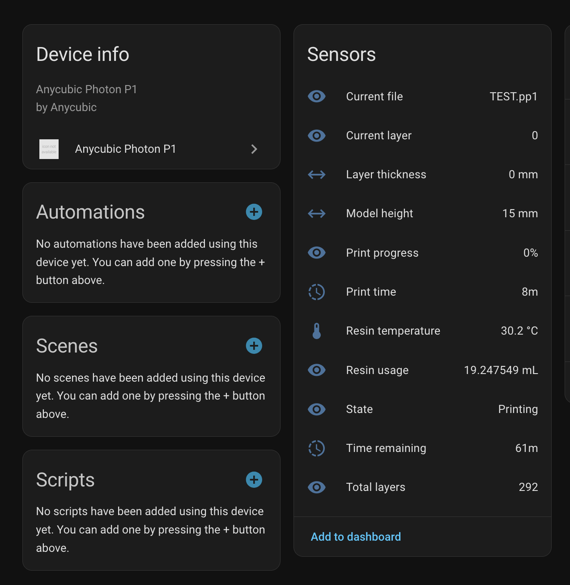

# Anycubic Photon P1 for Home Assistant

A [Home Assistant](https://www.home-assistant.io/) custom integration for the [Anycubic Photon P1](https://www.anycubic.com/) resin printer. Communicates with the printer over the local network using the built-in HTTP and MQTT services - no cloud account required.

**Note:** The printer only allows one MQTT client at a time. If the Anycubic Photon Workshop app connects, it will disconnect this integration, and vice versa.

## Installation

### HACS (recommended)

1. Open HACS in Home Assistant
2. Go to Integrations
3. Click the three-dot menu and select "Custom repositories"
4. Add this repository URL with category "Integration"
5. Search for "Anycubic Photon P1" and install it
6. Restart Home Assistant

### Manual

1. Copy the contents of this repository into `custom_components/anycubic_photon_p1/` in your Home Assistant config directory
2. Restart Home Assistant

## Configuration

1. Go to Settings -> Devices & Services -> Add Integration
2. Search for "Anycubic Photon P1"
3. Enter the printer's IP address

## Protocol

See [docs/protocol.md](docs/protocol.md) for details on the reverse-engineered LAN protocol.

## License

MIT - See [LICENSE.md](LICENSE.md).
